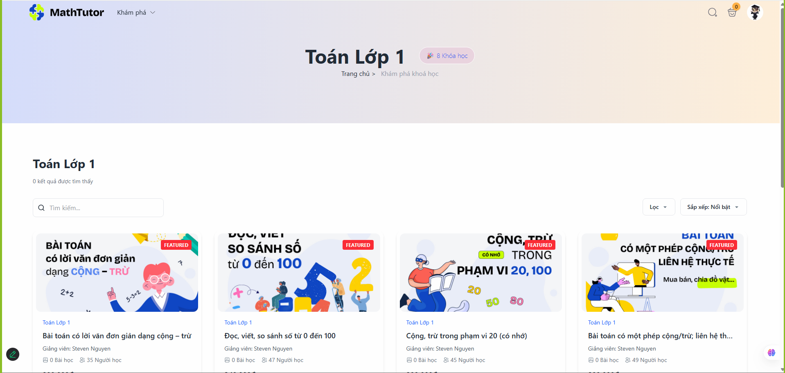
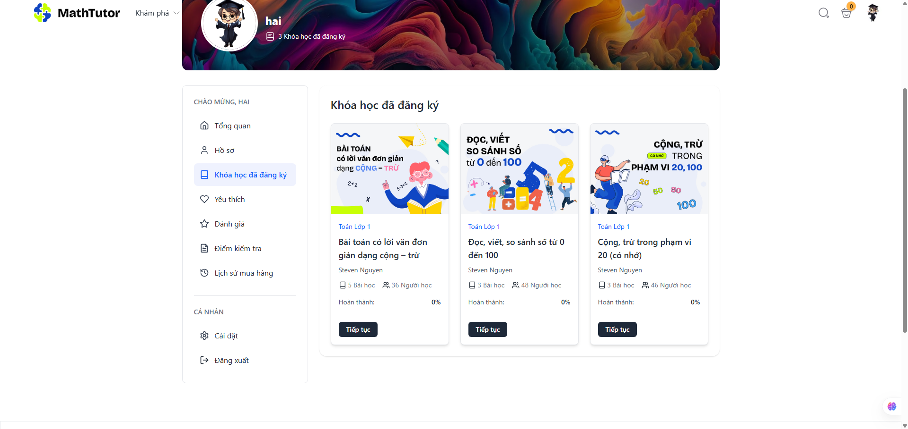
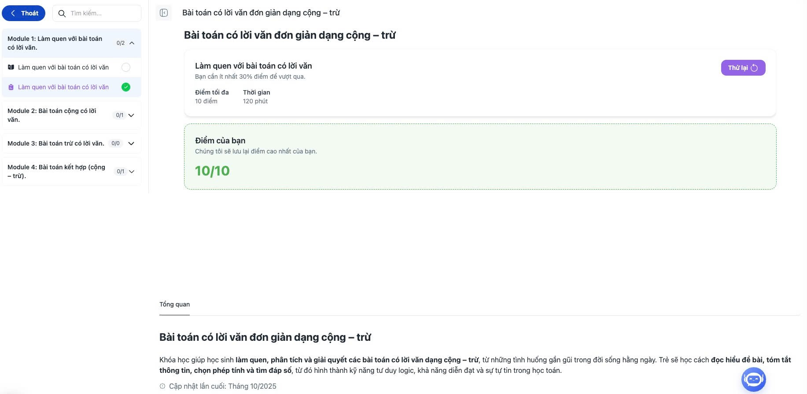
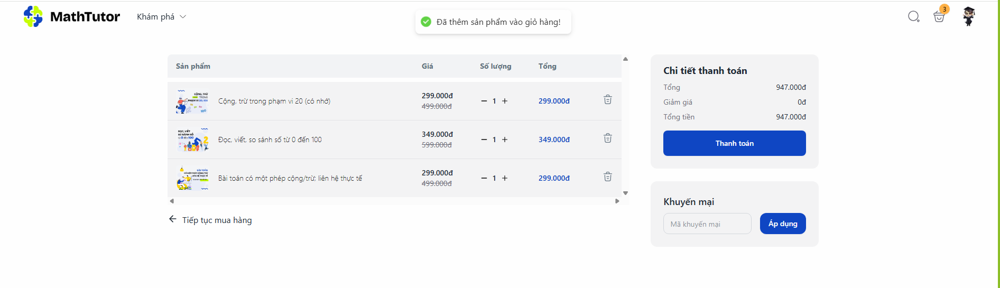
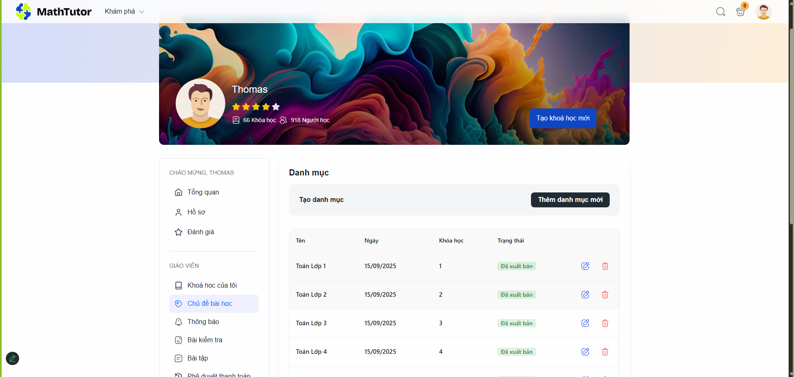
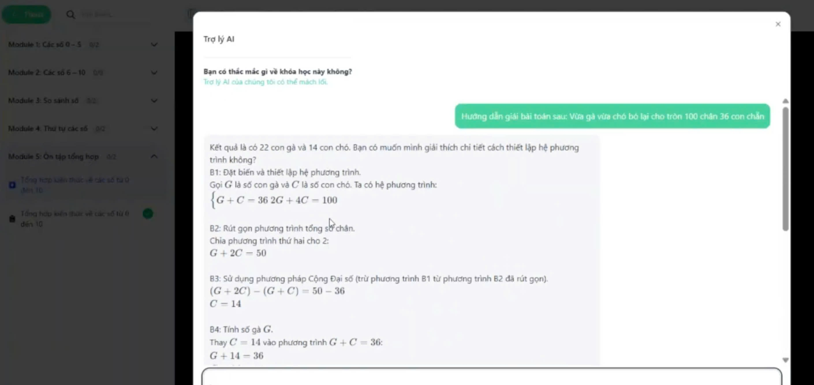

# 🧮 **Math Tutor – Chinh Phục Mọi Thử Thách Toán Học!**

## 📌 **Giới thiệu tổng quan**

Math Tutor là nền tảng giáo dục trực tuyến chuyên biệt dành cho học sinh cấp Tiểu học (từ lớp 1 đến lớp 5), tập trung vào việc **biến nỗi sợ toán thành niềm yêu thích** thông qua các khóa học chất lượng cao, video hướng dẫn sinh động và bài tập thực hành tương tác.

> 🎯 "Chinh Phục Mọi Thử Thách Toán Học! – Từ cơ bản đến nâng cao!"

## [LINK-WEBSITE](https://math-tutor-three.vercel.app/)

## [LINK-DEMO](https://drive.google.com/drive/folders/10Z-4rw31zzrqh8BUOhs05ETYinftf2v9?usp=sharing)

## 🌐 **Tính năng đa ngôn ngữ**

Math Tutor hỗ trợ **2 ngôn ngữ** chính:
- 🇻🇳 **Tiếng Việt** (vi) - Ngôn ngữ chính
- 🇺🇸 **English** (en) - Ngôn ngữ quốc tế

Với hơn **290+ translation keys** được tổ chức theo module, người dùng có thể dễ dàng chuyển đổi ngôn ngữ thông qua Language Switcher trên giao diện.

---

## 🎯 **Mục tiêu chính**

- **Biến nỗi sợ toán thành niềm yêu thích** cho học sinh tiểu học
- Cung cấp **khóa học chất lượng cao** từ cơ bản đến nâng cao
- Xây dựng **lộ trình học tập cá nhân hóa** phù hợp với từng độ tuổi
- Tạo **không gian học tập truyền cảm hứng** và thân thiện với trẻ em
- Hỗ trợ **phụ huynh** trong việc theo dõi tiến trình học tập của con

---

## 🧩 **Tính năng chính**

### ✅ 1. **Hệ thống đăng ký & xác thực**


- **Đăng ký tài khoản** với email/mật khẩu hoặc Google OAuth
- **Xác thực email** qua mã OTP 6 chữ số
- **Quên mật khẩu** và đặt lại mật khẩu mới
- **Đăng nhập Google** tích hợp với @react-oauth/google
- Giao diện thân thiện cho cả phụ huynh và học sinh nhỏ tuổi
- **Validation động** với Zod schema theo ngôn ngữ hiện tại

---

### 📚 2. **Hệ thống khóa học & bài học**



- **Danh mục khóa học**: Phân loại theo lớp học (1-5) và độ khó
- **Chi tiết khóa học**: Mô tả chi tiết, yêu cầu và kết quả học tập mong đợi
- **Nội dung đa dạng**: Video hướng dẫn sinh động, bài tập thực hành, trò chơi tương tác
- **Lộ trình cá nhân hóa**: AI đánh giá năng lực và đề xuất bài học phù hợp
- **Theo dõi tiến trình**: Hiển thị % hoàn thành và điểm số chi tiết
- **Course Builder**: Công cụ tạo khóa học với CKEditor5 và upload video
- **Course Status Management**: Xuất bản, Lưu trữ, Nháp

---

### 🎮 3. **Hệ thống bài tập & trò chơi tương tác**


- **Bài tập cơ bản**: Từ những phép tính đơn giản đến các dạng bài phức tạp
- **Thử thách nâng cao**: Các bài toán khó giúp phát triển tư duy logic
- **Hệ thống chấm điểm**: Đánh giá và phản hồi chi tiết
- **Gợi ý học tập**: Hướng dẫn giải bài khi học sinh gặp khó khăn
- **Practice Tracking**: Theo dõi tiến trình làm bài tập

---

### 👨‍🎓 4. **Dashboard học sinh**



- **Tổng quan học tập**: Thống kê khóa học đã đăng ký, đang học, đã hoàn thành
- **Khóa học của tôi**: Danh sách khóa học với tiến trình học tập chi tiết
- **Hồ sơ cá nhân**: Chỉnh sửa thông tin, avatar, cài đặt cá nhân
- **Thành tích học tập**: Theo dõi điểm số, huy hiệu, lịch sử học tập
- **Enrollment Management**: Quản lý các khóa học đã đăng ký
- **Progress Tracking**: Theo dõi tiến độ học tập chi tiết

---

### 🏆 5. **Hệ thống thành tích & động lực**



- **Lịch sử học tập**: Theo dõi chi tiết quá trình phát triển
- **Quiz System**: Hệ thống kiểm tra với nhiều dạng câu hỏi
- **Score Tracking**: Lưu trữ điểm số và kết quả bài kiểm tra
- **Attempt Management**: Quản lý các lần làm bài và lịch sử
- **Real-time Results**: Hiển thị kết quả ngay sau khi hoàn thành

---

### 🛒 6. **Hệ thống thanh toán & mua khóa học**



- **Giỏ hàng thông minh**: Thêm nhiều khóa học và quản lý đơn hàng
- **Checkout Flow**: 3 bước thanh toán với UI/UX tối ưu
- **Thanh toán an toàn**: Hỗ trợ QR Code và các phương thức thanh toán
- **Ưu đãi hấp dẫn**: Các chương trình khuyến mãi thường xuyên
- **Mua một lần, học trọn đời**: Mô hình giáo dục số hiệu quả
- **Lịch sử mua hàng**: Theo dõi các giao dịch đã thực hiện
- **Order Management**: Quản lý trạng thái đơn hàng (pending, completed, failed)

---

### 🔧 7. **Hệ thống quản trị (Admin)**



- **Dashboard quản trị**: Thống kê tổng quan về người dùng và khóa học
- **Course Management**: Tạo, chỉnh sửa, ẩn khóa học và bài học
- **Course Builder**: Công cụ tạo khóa học với các bước:
  - Tạo khóa học cơ bản
  - Thêm thông tin chi tiết
  - Upload video giới thiệu
  - Thiết lập giá cả
  - Cấu hình cài đặt
  - Thêm FAQ
- **Content Management**: Upload video, tài liệu, bài tập
- **Status Control**: Quản lý trạng thái khóa học (Draft, Published, Archived)
- **Module & Lesson Management**: Tạo chương và bài học chi tiết

---

### 🤖 8. **Hệ thống AI & Chatbot**



- **Math AI Assistant**: Chatbot hỗ trợ giải toán cơ bản
- **Smart Suggestions**: Gợi ý bài học phù hợp với trình độ
- **Real-time Help**: Hỗ trợ học sinh trong quá trình học
- **API Integration**: Kết nối với AI service qua proxy endpoints
- **Context-aware Responses**: Phản hồi thông minh dựa trên ngữ cảnh

---

## ⚙️ **Công nghệ sử dụng**

| Hạng mục       | Công nghệ sử dụng     |
|----------------|------------------------|
| **Frontend**   | Next.js 15, React 19, TypeScript |
| **UI Framework** | Tailwind CSS, Ant Design, shadcn/ui, Radix UI |
| **State Management** | Zustand, Redux Toolkit, React Query (TanStack Query) |
| **Form Handling** | React Hook Form, Zod validation |
| **Internationalization** | react-i18next, i18next |
| **Authentication** | JWT, Google OAuth (@react-oauth/google) |
| **Code Editor** | Sandpack React, CodeMirror, CKEditor5 |
| **Video Player** | React Player |
| **Charts & Analytics** | Recharts |
| **Animations** | Framer Motion |
| **Styling** | Tailwind CSS, CSS Modules |
| **Build Tools** | Next.js Turbopack, ESLint |

---

## 🚀 **Tính năng nổi bật**

- **🌍 Đa ngôn ngữ**: Hỗ trợ Tiếng Việt và English với 290+ translation keys
- **🎨 Giao diện tươi sáng**: Thiết kế thân thiện và truyền cảm hứng cho trẻ em
- **🤖 AI Integration**: Chatbot hỗ trợ học tập và gợi ý thông minh
- **💻 Code Editor**: Hỗ trợ lập trình C++ và Java với execution real-time
- **📱 Responsive Design**: Hoạt động mượt mà trên mọi thiết bị
- **🔒 Bảo mật cao**: JWT authentication và Google OAuth
- **⚡ Performance**: Next.js 15 với Turbopack cho tốc độ tải nhanh
- **🎯 SEO tối ưu**: Dễ dàng tìm kiếm và chia sẻ trên mạng xã hội
- **📊 Analytics**: Theo dõi tiến trình học tập chi tiết
- **🛒 E-commerce**: Hệ thống thanh toán và quản lý đơn hàng hoàn chỉnh

---

## 📱 **Đối tượng sử dụng**

- **Học sinh tiểu học**: Từ lớp 1 đến lớp 5 muốn học toán hiệu quả
- **Phụ huynh**: Theo dõi và hỗ trợ con em trong việc học toán
- **Giáo viên**: Sử dụng làm công cụ hỗ trợ giảng dạy và ôn tập
- **Trường học**: Tích hợp vào chương trình giáo dục chính thức
- **Quản trị viên**: Quản lý nội dung và người dùng hệ thống

---

## 🎨 **Giao diện & Trải nghiệm**

Math Tutor được thiết kế với giao diện tươi sáng và năng động, tạo cảm giác hứng thú cho học sinh khi học tập. Banner quảng cáo với các ưu đãi hấp dẫn như "Nhanh tay nhận ưu đãi đến 50%" giúp thu hút người dùng và khuyến khích đăng ký sớm.

### **Design System**
- **Color Palette**: Tông màu tươi sáng, thân thiện với trẻ em
- **Typography**: Font chữ dễ đọc, phù hợp với độ tuổi tiểu học
- **Components**: Sử dụng shadcn/ui và Ant Design cho consistency
- **Animations**: Framer Motion cho các hiệu ứng mượt mà
- **Responsive**: Mobile-first design với breakpoints tối ưu

---

## 🔮 **Tương lai phát triển**

- **📱 Ứng dụng di động**: Ra mắt app mobile để học mọi lúc mọi nơi
- **🎮 Trò chơi toán học**: Phát triển thêm các game tương tác
- **🤖 AI Tutor nâng cao**: Trợ lý học tập thông minh hỗ trợ 24/7
- **👥 Cộng đồng học tập**: Tạo không gian chia sẻ và học hỏi lẫn nhau
- **📊 Advanced Analytics**: Phân tích hành vi học tập chi tiết hơn
- **🌐 Mở rộng ngôn ngữ**: Thêm hỗ trợ cho các ngôn ngữ khác
- **🎯 Mở rộng cấp học**: Phát triển thêm cho học sinh THCS và THPT
- **🔗 API Integration**: Tích hợp với các nền tảng giáo dục khác

---

## 🛠️ **Cài đặt & Chạy dự án**

### **Yêu cầu hệ thống**
- Node.js 18+ 
- npm hoặc yarn
- Git

### **Cài đặt**
```bash
# Clone repository
git clone git@github.com:Haiongit/math-tutor.git
cd math-tutor

# Cài đặt dependencies
npm install

# Chạy development server
npm run dev

# Build production
npm run build
npm start
```

### **Environment Variables**
```env
NEXT_PUBLIC_CHATBOT_API_URL=your_chatbot_api_url
NEXT_PUBLIC_GOOGLE_CLIENT_ID=your_google_client_id
```

---

## 📈 **Kiến trúc hệ thống**

### **Frontend Architecture**
- **Next.js App Router**: Sử dụng App Router mới nhất
- **Component Structure**: Tổ chức theo feature và shared components
- **State Management**: Zustand cho global state, React Query cho server state
- **Type Safety**: TypeScript với strict mode
- **Code Organization**: Modular structure với clear separation of concerns

### **API Integration**
- **RESTful APIs**: Tích hợp với backend services
- **Error Handling**: Comprehensive error handling và user feedback
- **Loading States**: Optimistic updates và loading indicators
- **Caching**: React Query caching cho performance tối ưu

---

*Math Tutor - Nơi toán học trở thành niềm vui! 🎉*

---

**© 2024 Math Tutor. All rights reserved.**